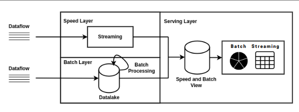

# BigDataSpark

This is a part of a big data project which encompasses both batch and data stream processing.
This java project is used accourding to our architecture for the data stream processing using [Seattle Real Time Fire 911 Calls API](https://data.seattle.gov/Public-Safety/Seattle-Real-Time-Fire-911-Calls/kzjm-xkqj) 

<p align="center">
  
</p>

For both components of the project, the execution of the generated Java applications will take place within an architecture consisting of three Docker containers. These containers serve specific roles, representing :
* **a master node (Namenode)** 
* **two slave nodes (Datanodes)**

each playing a crucial part in the overall functioning of the system.

**The master node (Namenode) container : hadoop-master** serves as the central control unit, overseeing the coordination and management of the distributed processing tasks. It takes charge of various responsibilities, such as tracking the location and metadata of the data stored across the slave nodes, managing access permissions, and orchestrating the overall data processing workflow.

On the other hand, **the two slave node (Datanode) containers : hadoop-slave1 , hadoop-slave2** serve as the distributed storage units, housing the actual data that is processed and analyzed. These nodes actively participate in the data processing pipeline, executing tasks assigned by the master node and providing the necessary resources for data storage and retrieval.

> Note : The following scripts should be run in **hadoop-master** after starting the docker container 
> ```
> ./start-hadoop.sh
> ./start-kafka-zookeeper.sh
> ```

### Dependencies 
This project have the following dependencies : 
* [Apache Spark](https://mvnrepository.com/artifact/org.apache.spark)
* [Apache Kafka](https://mvnrepository.com/search?q=apache+kafka)
* [Quartz Scheduler](https://mvnrepository.com/artifact/org.quartz-scheduler/org.motechproject.org.quartz-scheduler)
* [MongoDB Driver](https://mvnrepository.com/artifact/org.mongodb/mongo-java-driver)

### How to run it ?
1. generate the **JAR file** *(named SparkFireCalls-1-jar-with-dependencies.jar)* using a **maven run configuration** 
```
package clean install
```
2. copie the JAR file to the docker container **hadoop-master**
```
  docker cp target/SparkFireCalls-1-jar-with-dependencies.jar hadoop-master:/root
```
3. Create **mongodb database and collection** after installing `mongodb`
```
apt-get install mongodb 
mongo 
use 'fire-calls'
bd.createCollection('fire-calls-spark')
```
> Note : **mongo server** should be running in another ternimal :
> ```
> mongod
> ```
4. Create the **Kafka topic** `fire-calls`
```
kafka-topics.sh --create --zookeeper localhost:2181 --replication-factor 1 --partitions 1 --topic fire-calls
```
> Note : to check if the topic was created , you can run this command :
> ```
> kafka-topics.sh --list --zookeeper localhost:2181
> ```

To run the JAR file , we need :
    * **kafka producer** : responsible for retrieving data from the API, processing it, and sending it to the Kafka topic named `fire-calls`
    * **kafka consumer** : will retrieve the processed data from the `fire-calls` topic and store it in the MongoDB database named `fire-calls`.Specifically, the consumer will save the data in the `fire-calls-spark` collection.
> Note : The producer and consumer should be run in two speprate terminals on 'hadoop-master'
> ```
> kafka-topics.sh --list --zookeeper localhost:2181
> ```

6. Run the JAR file in **hadoop-master** : <br/>
  *  **kafka producer**
  ```
   spark-submit --class tn.insat.gl4.kafka.ApiReceiverProducer --master local[2] SparkFireCalls-1-jar-with-dependencies.jar
  ```
  *  **kafka consumer**
  ```
  spark-submit --class tn.insat.gl4.kafka.ApiReceiverConsumer --master local[2] SparkFireCalls-1-jar-with-dependencies.jar 
  ```
> Note : **mongo server** should be running in another ternimal when executing the JAR file :
> ```
> mongod
> ```
* To check if the resulted data has been stored in the database all you have to do is executing these commands in **hadoop-master** while still having the mongodb server up
```
mongo fire-calls
db['fire-calls-spark'].find()
```
## Collaborators 
| Raoua Trimech | Hadil Helali | Soulaima Kahla |
| ---- | ---- | ---- |
